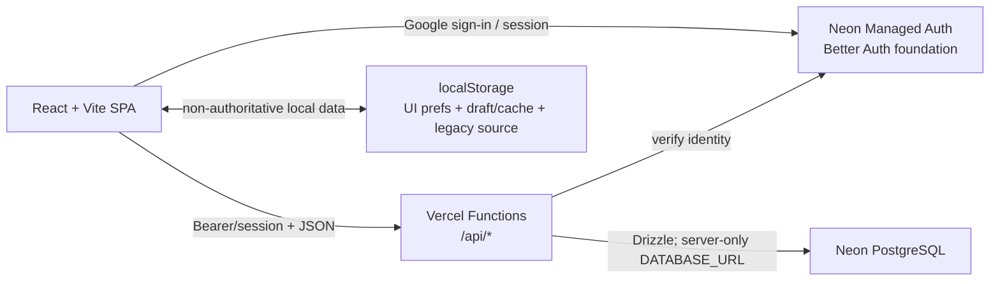
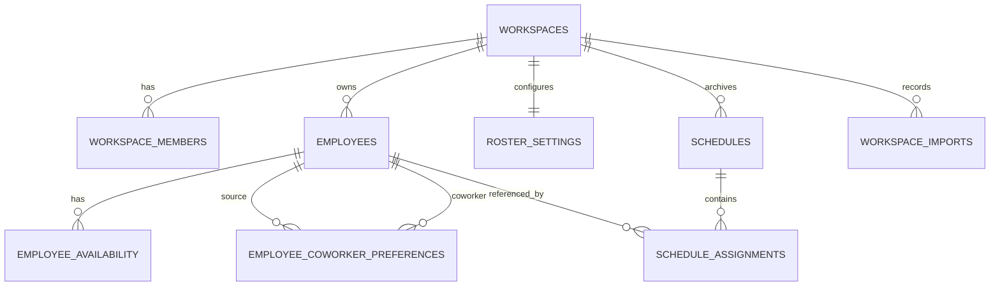
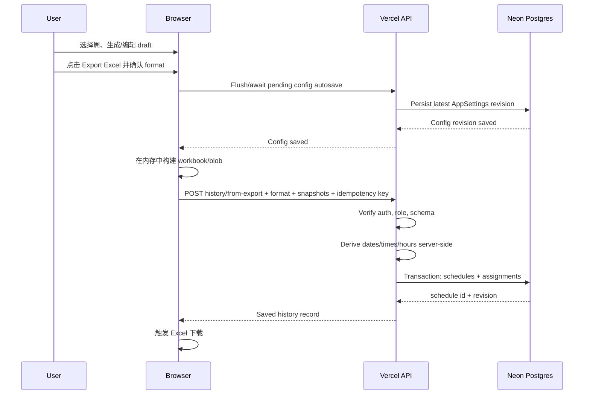

# Auto Shift Scheduler 后端、数据库、认证与 History 实施方案

> 2026-08-10 开发实现说明：首个非生产代码切片已落地，生成的 Drizzle migration 尚未执行。为无损保留现有 `emp-*` ID 并避免改变算法输入，本切片把 employee canonical key 调整为 `(workspace_id uuid, id text)`，不再在首次导入时重映射 UUID；History assignment 同时保存该复合员工引用和姓名 snapshot。当前配置仍以同一个 transaction 保存，但 `shiftDemand`、`shiftTemplates`、`specialSettings` 保持完整 JSONB，以保证与现有 `AppSettings` 深度等价。实际操作清单见 `NEON_SETUP_CHECKLIST.md`。

> 文档状态：分析方案，尚未实施
> 审计日期：2026-08-10（Pacific/Auckland）
> 审计对象：当前工作区（包含尚未提交的本地修改）
> 本阶段限制：不执行数据库 migration、不创建或修改 Production 数据、不部署 Production、不大规模修改现有代码。

## 1. 结论摘要

建议保留现有 React + Vite SPA 和现有排班算法，在同一个 Vercel 项目内增加 Vercel Functions 作为业务 API 层：

```text
React/Vite browser
  ├─ Neon Managed Auth（Google 登录、会话）
  └─ same-origin /api/*
       ├─ 校验 Neon Auth 身份和 workspace 成员权限
       ├─ Drizzle ORM
       └─ Neon PostgreSQL（仅 server-side 连接）
```

主要决策：

1. **不迁移到 Next.js。** 当前 Vite 项目可以直接在 Vercel 上增加 `api/` Functions，迁移框架会扩大风险且对目标没有必要。
2. **选择 Drizzle ORM。** 它与现有 TypeScript 模型接近、运行时代码轻、适合 Neon HTTP/serverless，并能保留显式 SQL 和可审阅 migration。
3. **业务数据不从浏览器直连 PostgreSQL。** `DATABASE_URL` 只存在于 Vercel Function 环境；任何 `VITE_*` 变量都不能包含数据库凭据。
4. **使用 Neon Managed Auth（底层为 Better Auth），不是在项目中自托管 Better Auth server。** Google provider、trusted origins 和 OAuth secret 由 Neon Auth 管理；React 使用 Neon 的 Auth client。
5. **配置和排班 draft 分离，并把 Excel 导出定义为唯一 History 保存边界。** 所有排班配置每次更改都自动保存到数据库，不需要点击 Excel 导出，也没有手动 Save 按钮；配置 autosave 不创建 History。自动生成、候选切换、手动编辑和自动补全只修改 schedule draft。只有用户在主 Schedule 页面确认导出 Excel 时，才创建不可变 History；未点击实际导出则不保存 History。
6. **History 同时保存 JSON snapshot 和结构化 assignments。** snapshot 保证未来修改员工、班次时间或算法后仍能原样查看/导出；assignments 用于可靠、快速的 SQL 统计。
7. **历史统计首期实时聚合，不建缓存。** 每周记录数据量很小，且 History 不可变；缓存会增加一致性风险而收益很低。
8. **建议在原七张业务表之外增加 `employee_coworker_preferences` 和 `workspace_imports`。** 前者对应当前实际数据模型，后者保证 localStorage 首次迁移可审计、可重试且不会重复导入。

## 2. 当前架构审计

### 2.1 框架与构建

| 项目 | 当前状态 | 证据 |
|---|---|---|
| 前端框架 | React 19 SPA | `src/main.tsx`、`src/App.tsx` |
| 构建工具 | Vite 6 | `vite.config.ts` |
| 语言 | TypeScript，strict mode | `tsconfig.json` |
| 路由 | 无 URL router；页面由 `App.tsx` 内 `page` state 切换 | `src/App.tsx:66-87` |
| package manager | pnpm；lockfile v9；GitHub workflow 固定 pnpm 9 | `pnpm-lock.yaml`、`.github/workflows/deploy.yml` |
| Node 基线 | GitHub workflow 使用 Node 22 | `.github/workflows/deploy.yml` |
| Excel | `xlsx-js-style`，全部在浏览器生成 | `src/exporters.ts` |
| 测试 | Vitest；当前 6 个测试通过 | `src/scheduler.test.ts`、`src/settings/appStateActions.test.ts` |

`package.json` 没有 `packageManager` 字段。实施时建议增加类似 `"packageManager": "pnpm@9.x"`，避免本地、GitHub Actions 和 Vercel 使用不同 pnpm major；这不是本阶段要执行的修改。

2026-08-10 审计验证结果：

- `pnpm test`：2 个 test files、6 个 tests 全部通过。
- `pnpm build`：TypeScript 和 Vite build 通过。
- 构建产生约 1.129 MB 的主 JS chunk（gzip 约 403.58 KB），Vite 给出大 chunk 警告。它不阻塞后端阶段，但 History 和 Auth 应优先 lazy-load，避免继续扩大首屏 bundle。

### 2.2 当前部署与 Vercel 架构

仓库中可确认的部署事实：

- 存在 GitHub Pages workflow：`main` push 后构建 `dist` 并部署 Pages。
- 仓库没有 `vercel.json`、`.vercelignore`、`.vercel/` 元数据，也没有 Vercel Function。
- 当前构建输出是纯静态 `dist`。
- 用户确认项目已部署在 Vercel，因此从仓库证据推断，当前 Vercel 项目采用 Git 集成和 Vite 自动识别：安装依赖、执行 `pnpm build`、发布 `dist`。

仅凭仓库无法确认的 Vercel 控制台配置，实施前必须只读核对：

- Production/Preview 的 root directory、install/build/output 命令；
- Node 与 pnpm 版本；
- Production domain 和 Preview domain；
- Git 自动部署分支；
- 当前是否已有未提交到仓库的 rewrites/headers；
- 当前环境变量和 Neon Marketplace integration 状态。

新增后端后，Vercel 将从“静态 Vite 站点”变为“静态 Vite 前端 + `/api` Vercel Functions”。GitHub Pages 无法运行这些 Functions，需要明确选择：

- 推荐：Vercel 是完整应用；GitHub Pages 只保留 guest/local-only demo，并在 UI 中明确不支持登录/云同步；或
- 后续确认后停止 GitHub Pages 生产入口，避免用户在两个行为不同的网址间混淆。

本方案不在当前阶段修改该 workflow。

### 2.3 当前服务器端 API、认证与 ORM

- **服务器端 API：不存在。** 仓库没有 `api/`、server runtime 或网络请求代码。
- **认证：不存在。** 没有 Auth client、OAuth、session、cookie 或 token 校验代码。
- **ORM/数据库工具：不存在。** 没有 Drizzle、Prisma、Postgres driver 或 migration 文件。
- **当前持久化：浏览器 localStorage。** `AppStateStore` 还是同步接口，无法直接承载异步远程加载和保存。

### 2.4 所有 localStorage key

全仓库只有一个正式 key：

```text
auto-shift-scheduler:app-state
```

定义在 `src/storage.ts:5`。其值是完整 `AppState` JSON。没有发现其他 localStorage、sessionStorage、IndexedDB 或 cookie 使用。

当前行为：

- 首次没有 key 时使用 `createDefaultState()`。
- 有值时 `JSON.parse` 后通过 `normalizeAppState()` 补默认值。
- 任意 `AppState` 变化都会由 `usePersistentAppState()` 立即把完整 state 写回 localStorage。
- JSON import 会替换完整 state；JSON export 导出完整 state。

### 2.5 当前完整 AppState

`src/types.ts` 当前定义：

```ts
type AppSettings = {
  employees: Employee[];
  availability: AvailabilityMap;
  preferences: PreferenceMap;
  shiftDemand: ShiftDemand;
  shiftTemplates: ShiftTemplateMap;
  specialSettings: SpecialSettings;
};

type AppState = AppSettings & {
  schedule: WeeklySchedule;
};
```

当前未提交的重构已经把 `AppSettings` / `SchedulingInput` 从 `AppState` 中抽出，这是下一阶段非常有价值的边界，应继续沿用，但不要在接入数据库时顺便改算法。

#### Employee

```ts
type Employee = {
  id: string;
  name: string;
  type: "full-time" | "casual";
  enabled: boolean;
};
```

员工显示顺序由 `employees` 数组顺序决定；数据库必须保存 `sort_order`。

#### Availability

```ts
type AvailabilityEntry = {
  available: boolean;
  start: string; // "HH:mm"
  end: string;   // "HH:mm"
};

type AvailabilityMap = Record<employeeId, Record<Day, AvailabilityEntry>>;
```

这是每周重复的 Monday-Sunday availability，不是某个日期的例外配置。

#### Employee preferences

```ts
type EmployeePreference = {
  shiftPreference: "early" | "mid" | "late" | "any";
  refuseLateShift: boolean;
  minDays: number;
  maxDays: number;
  coworkers: Array<{
    coworkerId: string;
    type: "hard" | "soft";
  }>;
};
```

#### Shift demand / templates

```ts
type ShiftDemand = Record<Day, Record<"early" | "mid" | "late", number>>;

type ShiftTemplateMap = Record<Day, Record<"early" | "mid" | "late", {
  start: string;
  end: string;
}>>;
```

共有 7 × 3 个需求值和 7 × 3 个班次时间模板。

#### Special settings

```ts
type SpecialSettings = {
  earlyAllowedEmployeeIds: string[];
  priorityMode: "balance-first" | "binding-first" | "work-day-first";
  shiftTypeCapEnabled: boolean;
};
```

#### 当前 schedule

```ts
type ShiftAssignment = {
  employeeId: string;
  shiftType: "early" | "mid" | "late";
};

type WeeklySchedule = Record<Day, ShiftAssignment[]>;
```

重要缺口：`WeeklySchedule` 本身没有 `weekStart`/`weekEnd`。`weekStartDate` 只存在于 `App.tsx` 的 React state，切换上一周/下一周仍显示同一个 `state.schedule`。因此历史迁移不能猜测 localStorage 中 schedule 属于哪一周，必须让用户选择日期范围。

### 2.6 自动排班算法

位置：`src/scheduler.ts`。

主要入口：

- `generateWeeklyScheduleOptions(state, optionCount = 5)`：最多尝试 60 个 seed，去重并按 score 返回 5 个候选。
- `generateWeeklySchedule(state)`：取第一个候选。
- `autoCompleteScheduleFrom(state, initialSchedule)`：保留已有手工 assignment 并补缺。
- `upsertManualShift` / `deleteManualShift`：手工编辑。

算法输入是 `SchedulingInput = AppSettings`。它依赖以下全部配置：

- employees（包含数组顺序、type、enabled）；
- availability；
- preferences（班型、拒绝晚班、min/max days、coworker binding）；
- shiftDemand；
- shiftTemplates；
- specialSettings。

最终输出仍是 `WeeklySchedule`，assignment 不带日期、起止时间或工时。实际时间由 `getShiftTemplate(day, shiftType, state.shiftTemplates)` 动态解析。

保持算法结果的要求：

- 后端接入不应把算法移到服务器，也不应改 `scheduler.ts` 的候选排序、seed、score 或 rebalance 逻辑。
- 数据库加载后的对象必须先规范化为与当前 `SchedulingInput` 完全相同的形状。
- 现有 characterization tests 必须作为回归门禁；再增加一组“数据库 DTO → AppSettings → 输出 signature”测试。
- 如迁移时把 legacy employee id 重映射为 UUID，比较结果时应按员工业务身份/姓名 + day + shiftType 比较，而不是比较旧 ID 字符串。

### 2.7 统计与 Excel 所依赖的数据

`src/stats.ts` 的统计逻辑：

- `workDays`：assignment 数量；当前模型保证每个员工每天最多一个 assignment。
- `earlyCount` / `midCount` / `lateCount`：按 shiftType 计数。
- `totalHours`：从当时 `shiftTemplates` 的 start/end 计算时长。
- `countHours`：`totalHours - workDays`，即每个班次固定减 1 小时。

`src/exporters.ts` 的 Excel/JSON 依赖：

- `employees`：employeeId → 当时姓名；
- `schedule`：每天的 employeeId + shiftType；
- `shiftTemplates`：班次 start/end；
- `weekStartDate`：生成实际日期和文件名；
- `calculateEmployeeStats(state)`：General workbook 统计页；
- JSON backup：完整 `AppState`。

因此 History 不能只保存 `schedule_assignments.employee_id` 外键。员工以后可能改名或被停用，班次模板也可能修改；历史页面和 Excel 必须使用生成当时的 snapshot。

## 3. 目标架构

### 3.1 组件边界



推荐目录边界（实施时再创建）：

```text
api/                       # Vercel Function entrypoints
server/
  auth/                    # token/session verification
  db/
    client.ts              # server-only DB client
    schema.ts              # Drizzle schema
    migrations/            # generated + reviewed SQL
  repositories/            # workspace/config/schedule queries
  validation/              # request + snapshot schemas
src/
  auth/                    # browser auth client/provider
  api/                     # typed fetch client; no DB imports
  app/                     # async hydration/sync state
  history/                 # list/detail/read-only views
  scheduler.ts             # unchanged algorithm
```

通过目录和 lint/import 规则保证 `server/db/*` 永远不会被 Vite client bundle 引用。

### 3.2 权威数据边界

| 数据 | 登录前 | 登录后 | History |
|---|---|---|---|
| 排班配置 | legacy/local guest state | Neon DB 是权威源；每次配置更改自动保存，local 仅缓存 | `settings_snapshot` 不可变 |
| 当前 draft schedule | local | 首期仍为 local draft，可后续增加云 draft | 不适用 |
| 正式周排班 | 不存在 | 主页面实际导出 Excel 时写入 Neon DB `schedules` | 不可变记录 |
| 结构化班次 | 不存在 | Excel 导出触发 History transaction 时生成 | `schedule_assignments` |
| UI preference | local/in-memory | localStorage | 不进入 History |

首期不建议为了“云端配置同步”顺带实现多人实时协作或云 draft。登录时加载；每个配置逻辑变更自动进入保存队列；冲突检测；重新聚焦时刷新。这里的“配置”只指 `AppSettings`，不包含当前 schedule draft，也不会写入 History。

## 4. 数据库 schema 评估与调整

### 4.1 对原七表方案的评价

原方案方向正确：

- `workspaces` / `workspace_members` 提供多租户和未来共享基础；
- `employees` / `employee_availability` 对应主要配置实体；
- `roster_settings` 承载周规则；
- `schedules` + `schedule_assignments` 同时支持不可变快照和结构化统计。

但按当前代码还缺两个明确的数据集合：

1. `EmployeePreference.coworkers` 是 employee-to-employee 多对多关系，不能无损放入现有列结构，因此增加 `employee_coworker_preferences`。
2. localStorage 迁移需要去重、审计和失败重试状态，因此增加 `workspace_imports`。这张表也避免仅依赖某台浏览器的 migration marker。

员工的简单偏好字段直接并入 `employees`；`earlyAllowedEmployeeIds` 也转换成每个 employee 的 `early_shift_allowed`，避免在 JSON 数组里保留悬空 ID。

### 4.2 推荐表定义

以下为逻辑 schema；具体 Drizzle/SQL migration 只在后续开发分支和 Neon 非生产 branch 中实现。

#### `workspaces`

| 字段 | 类型 | 说明 |
|---|---|---|
| id | uuid PK | `gen_random_uuid()` |
| name | text | workspace 显示名 |
| timezone | text | 默认 `Pacific/Auckland`；用于周边界和显示 |
| week_starts_on | smallint | 固定/默认 1（Monday） |
| created_by | text | Neon Auth user id |
| created_at | timestamptz | server timestamp |
| updated_at | timestamptz | server timestamp |

`created_by` 使用 text。Neon Managed Auth 的用户表位于受管理的 `neon_auth` schema；在确认实际版本和表名之前，不由应用 migration 创建跨 schema FK，以免与托管 schema 升级耦合。

#### `workspace_members`

| 字段 | 类型 | 说明 |
|---|---|---|
| workspace_id | uuid FK → workspaces | tenant |
| user_id | text | Neon Auth user id |
| role | text CHECK | `owner` / `editor` / `viewer` |
| joined_at | timestamptz | 加入时间 |

主键：`(workspace_id, user_id)`；索引：`(user_id, workspace_id)`。

#### `employees`

| 字段 | 类型 | 说明 |
|---|---|---|
| id | uuid PK | 新 canonical id |
| workspace_id | uuid FK | tenant |
| legacy_source_id | text nullable | 首次导入旧 `emp-*` ID；用于幂等映射 |
| name | text | 员工姓名 |
| employment_type | text CHECK | `full-time` / `casual` |
| enabled | boolean | 是否参与排班 |
| sort_order | integer | 保留当前数组顺序 |
| shift_preference | text CHECK | `early` / `mid` / `late` / `any` |
| refuse_late_shift | boolean | 当前 preference 字段 |
| min_days | smallint | 0..7 |
| max_days | smallint | 0..7，且 `min_days <= max_days` |
| early_shift_allowed | boolean | 由 `earlyAllowedEmployeeIds` 映射 |
| archived_at | timestamptz nullable | 软删除；历史 FK 不被破坏 |
| created_at / updated_at | timestamptz | 审计 |

约束/索引：

- `UNIQUE(workspace_id, legacy_source_id)`，仅对非 null 值生效；
- `UNIQUE(workspace_id, id)`，供带 workspace 的复合 FK 使用；
- 不对姓名做唯一约束；现实中可能重名；
- 正式员工删除改为 archive，不能像当前前端一样物理删除历史所引用的员工。

#### `employee_availability`

| 字段 | 类型 | 说明 |
|---|---|---|
| workspace_id | uuid | tenant 防护 |
| employee_id | uuid | employee FK |
| day_of_week | smallint | ISO 1=Monday ... 7=Sunday |
| available | boolean | 是否可用 |
| start_time | time | 本地墙钟时间 |
| end_time | time | 本地墙钟时间 |
| updated_at | timestamptz | 审计 |

主键：`(employee_id, day_of_week)`；复合 FK：`(workspace_id, employee_id)` → employees。首期保持现有语义 `end_time > start_time`，不擅自加入跨午夜班次规则。

#### `employee_coworker_preferences`（新增）

| 字段 | 类型 | 说明 |
|---|---|---|
| workspace_id | uuid | tenant |
| employee_id | uuid | 发起 preference 的员工 |
| coworker_id | uuid | 被关联员工 |
| preference_type | text CHECK | `hard` / `soft` |
| created_at / updated_at | timestamptz | 审计 |

主键：`(employee_id, coworker_id)`；检查 `employee_id <> coworker_id`；两端都用 `(workspace_id, employee_id)` 形式的复合 FK，避免跨 workspace 绑定。

这里保留当前**有方向**的关系语义；不要自动写反向记录。算法当前会检查双方设置并选取最强关系。

#### `roster_settings`

| 字段 | 类型 | 说明 |
|---|---|---|
| workspace_id | uuid PK/FK | 每 workspace 一行 |
| shift_demand | jsonb | 完整 7 × 3 demand map |
| shift_templates | jsonb | 完整 7 × 3 start/end map |
| priority_mode | text CHECK | 三种现有 mode |
| shift_type_cap_enabled | boolean | 当前安全开关 |
| schema_version | integer | 配置 JSON 版本 |
| revision | bigint | optimistic concurrency version |
| updated_by | text | Auth user id |
| updated_at | timestamptz | server timestamp |

`shift_demand` 和 `shift_templates` 选择 JSONB，而不是再拆 42 行，原因是它们总是作为一个小型、固定、整体的 `AppSettings` 配置读取和保存，且算法需要完整 map。API 层必须用共享 schema 严格验证 7 个 day 和 3 个 shiftType，数据库可增加 JSON shape checks。

若未来要支持多个 roster template、节假日覆盖或 SQL 分析，再引入 `roster_shift_rules`；本阶段不提前复杂化。

#### `schedules`

| 字段 | 类型 | 说明 |
|---|---|---|
| id | uuid PK | History id |
| workspace_id | uuid FK | tenant |
| week_start | date | workspace 时区下的 Monday |
| week_end | date | 必须等于 `week_start + 6` |
| revision | integer | 同一周的第几次 Excel 导出/History 版本 |
| source | text CHECK | draft 来源：`auto` / `auto-complete` / `manual` / `mixed` / `legacy-draft` |
| history_trigger | text CHECK | 首期固定为 `excel-export` |
| export_format | text CHECK | `general` / `chapanda`，对应现有两个 Excel 模式 |
| schedule_snapshot | jsonb | 完整、规范化的 `WeeklySchedule` |
| settings_snapshot | jsonb | 生成当时完整 `AppSettings` |
| warnings_snapshot | jsonb | 生成时 warning，可选但推荐 |
| snapshot_schema_version | integer | snapshot 解析版本 |
| algorithm_version | text | Git SHA/明确算法版本 |
| idempotency_key | uuid | 防重复提交 |
| import_fingerprint | text nullable | legacy import 幂等 |
| created_at | timestamptz | 用户确认 Excel 导出、History transaction 成功的时间 |
| created_by | text | Auth user id |

约束/索引：

- `UNIQUE(workspace_id, week_start, revision)`；同一周每次实际 Excel 导出创建一个新版本；
- `UNIQUE(workspace_id, idempotency_key)`；
- `(workspace_id, created_at DESC, id DESC)` 用于 cursor pagination；
- `(workspace_id, week_start DESC, revision DESC)` 用于按周查找；
- History 行一旦创建不可更新。允许后续增加 `voided_at/voided_by`，不做物理删除。

Snapshot 建议固定为：

```ts
type SettingsSnapshotV1 = {
  schemaVersion: 1;
  employees: Employee[];
  availability: AvailabilityMap;
  preferences: PreferenceMap;
  shiftDemand: ShiftDemand;
  shiftTemplates: ShiftTemplateMap;
  specialSettings: SpecialSettings;
};

type ScheduleSnapshotV1 = {
  schemaVersion: 1;
  schedule: WeeklySchedule;
};
```

历史详情可以无损重建：

```ts
const historicalAppState: AppState = {
  ...settingsSnapshot,
  schedule: scheduleSnapshot.schedule,
};
```

这样现有班表渲染、统计和 Excel exporter 可以复用同一数据契约，只需提供 read-only 模式和历史 `weekStartDate`。

#### `schedule_assignments`

| 字段 | 类型 | 说明 |
|---|---|---|
| id | uuid PK | assignment row id |
| workspace_id | uuid | tenant/index |
| schedule_id | uuid FK | 所属 History |
| employee_id | uuid FK | 结构化员工引用，禁止 hard delete |
| employee_name_snapshot | text | 员工改名后历史仍显示原名 |
| employee_type_snapshot | text | 生成时 employment type |
| work_date | date | 实际日期，不是 `Monday` 字符串 |
| shift_type | text CHECK | `early` / `mid` / `late` |
| start_time | time | 生成时班次起始时间 |
| end_time | time | 生成时班次结束时间 |
| calculated_hours | numeric(6,2) | 当前 `end - start` 语义 |
| unpaid_break_minutes | smallint | 当前为 60；冻结统计语义 |
| counted_hours | numeric(6,2) | 当前为 `calculated_hours - 1` |
| created_at | timestamptz | 审计 |

约束/索引：

- `UNIQUE(schedule_id, employee_id, work_date)`；
- `(schedule_id, employee_id)` 用于统计；
- `(workspace_id, work_date)` 用于 workspace 日期查询；
- `calculated_hours >= 0`、`counted_hours >= 0`；
- 由 server 根据 settings snapshot 计算日期、时间和工时，不能信任浏览器提交的派生字段。

`calculated_hours` 按本地墙钟差值计算，继续保持当前算法，不用带时区 timestamp 相减；否则 Auckland DST 周可能改变现有结果。

#### `workspace_imports`（新增）

| 字段 | 类型 | 说明 |
|---|---|---|
| id | uuid PK | import attempt |
| workspace_id | uuid FK | target |
| imported_by | text | Auth user id |
| source_key | text | `auto-shift-scheduler:app-state` |
| payload_fingerprint | text | canonical JSON SHA-256 |
| status | text CHECK | `pending` / `completed` / `failed` |
| config_revision | bigint nullable | 导入后的配置版本 |
| summary | jsonb | 数量、warning、ID 映射摘要 |
| created_at / completed_at | timestamptz | 审计 |

唯一约束：`(workspace_id, payload_fingerprint)`。失败记录可重试，已完成记录返回原结果，避免重复导入同一份配置。

### 4.3 表关系



Neon Managed Auth 自己维护 `neon_auth.*`。`workspace_members.user_id`、`created_by` 等字段逻辑上引用 Auth user id，但首期不由应用 migration 修改托管 schema。

## 5. 哪些数据进入数据库

### 5.1 必须进入数据库的正式配置

| 当前字段 | 目标表 |
|---|---|
| employees.id/name/type/enabled/order | employees |
| preferences.shiftPreference/refuseLateShift/minDays/maxDays | employees |
| specialSettings.earlyAllowedEmployeeIds | employees.early_shift_allowed |
| availability | employee_availability |
| preferences.coworkers | employee_coworker_preferences |
| shiftDemand | roster_settings.shift_demand |
| shiftTemplates | roster_settings.shift_templates |
| specialSettings.priorityMode | roster_settings.priority_mode |
| specialSettings.shiftTypeCapEnabled | roster_settings.shift_type_cap_enabled |

这些字段全部影响算法结果或正式班表显示，登录后必须从 DB 加载并同步。

### 5.2 Excel 导出时保存的正式 History 数据

- `week_start`、`week_end`；
- 完整 `schedule_snapshot`；
- 完整 `settings_snapshot`；
- 结构化 `schedule_assignments`；
- warnings、source、algorithm version、created_at、created_by；
- 导出触发类型 `excel-export` 和 Excel format（`general` / `chapanda`）；
- 同一周 revision。

### 5.3 继续放 localStorage 的 UI preference

建议使用新的 versioned key，例如 `auto-shift-scheduler:ui-preferences:v1`：

- 当前 sidebar page；
- 当前选中 day；
- 当前选中 employee；
- 最近 workspace id；
- History filter、sort、page size；
- modal 展开状态不必持久化；
- theme/语言（未来若增加）。

以下不是“正式云配置”，首期可在 localStorage 使用独立 key：

- 当前尚未正式保存的 schedule draft；
- draft 的 `weekStartDate`；
- 未提交的候选方案和选中方案；
- 最近一次 server config cache（只作为离线/启动缓存，带 workspace、revision、cachedAt，不能覆盖 server）。

`weekStartDate` 虽可存在 local draft，但它不是普通 UI preference；实际导出 Excel 时必须随 History request 发送并由 server 校验。

## 6. API 与数据流

### 6.1 推荐 API

可用一个 catch-all Vercel Function 加轻量 router，减少 Function 数量；也可按资源拆分。外部契约建议：

| Method | Path | 用途 |
|---|---|---|
| GET | `/api/bootstrap` | session 用户、workspaces、默认 workspace 摘要 |
| POST | `/api/workspaces` | 首次创建 workspace |
| GET | `/api/workspaces/:id/config` | 获取完整 AppSettings + revision |
| PUT | `/api/workspaces/:id/config` | 原子保存完整配置；携带 expectedRevision |
| GET | `/api/workspaces/:id/history` | cursor 分页、week 过滤 |
| POST | `/api/workspaces/:id/history/from-export` | Excel 导出确认时，把当前 draft 原子保存为 History |
| GET | `/api/workspaces/:id/history/:scheduleId` | snapshot + assignments + stats |
| POST | `/api/workspaces/:id/imports/local-storage` | 幂等 legacy import |
| GET | `/api/workspaces/:id/imports/:fingerprint` | 查询迁移状态 |

首期配置规模很小，`PUT config` 保存完整 `AppSettings` 比十几个细粒度 endpoints 更容易保持原子性。每个前端配置 mutation 都自动提交最新完整 `AppSettings`；server 在一个 transaction 中 diff/upsert employees、availability、coworker preferences 和 roster settings，再把 revision `+1`。不提供手动“保存配置”按钮。

### 6.2 登录后的总体数据流

```mermaid
sequenceDiagram
    participant B as Browser
    participant A as Neon Auth
    participant F as Vercel API
    participant D as Neon Postgres

    B->>A: Google sign-in
    A-->>B: Managed session / token
    B->>F: GET /api/bootstrap + auth
    F->>A: Verify session/token
    F->>D: Load memberships
    D-->>F: Workspaces
    F-->>B: User + workspace summary
    B->>F: GET workspace config
    F->>D: Membership-scoped query
    D-->>F: AppSettings rows + revision
    F-->>B: Normalized AppSettings
    B->>B: Hydrate state; enable editing
```

关键点：在 auth/session 和远程 config 完成前，不运行当前 `useEffect(() => store.save(state))`。否则默认 state 可能在 hydration 期间覆盖云端数据。

## 7. 登录流程（Neon Managed Better Auth + Google）

### 7.1 推荐实现方式

当前项目是 React SPA，建议使用 Neon Managed Auth 的 React/browser client，连接：

```text
import.meta.env.VITE_NEON_AUTH_URL
```

不要在此项目里另起一个自托管 `betterAuth({...})` server。Neon Managed Auth 虽以 Better Auth 为基础，但托管端已经负责用户、session、OAuth callback、配置和 JWKS；应用应使用 Neon 官方 SDK。因为本方案不从浏览器直接使用 Data API，优先选 auth-only SDK；实施时先在 dev branch 用官方当期 React quickstart 做一个最小 spike，再锁定确切 package/version 和 token 获取 API。若后续决定使用 Neon Data API，再考虑统一的 `@neondatabase/neon-js`。

流程：

1. App 启动，Auth provider 恢复 session。
2. 未登录显示 Google 登录入口；guest 模式如继续保留，必须明确仅存本机。
3. 用户触发 Google social sign-in。
4. Google 回调到 Neon Auth 为该 branch 提供的**精确 callback URL**。
5. Neon Auth 建立 session，客户端回到应用。
6. Browser 从 Neon SDK 获取 API 可使用的 session/JWT，并请求同源 `/api/bootstrap`。
7. Vercel Function 通过 Neon Auth issuer/JWKS 或 SDK 的 server verification 方法验证 token；不能信任 request body 中的 `userId`。
8. Function 用验证后的 subject 查询 `workspace_members`，再执行 tenant-scoped 数据操作。

由于 Neon Auth SDK 在 2025-2026 有过 breaking changes，实施时必须按当期官方 React/Vite 文档确定函数名；本方案不写死可能过期的伪 API。

### 7.2 首次登录 workspace

- 用户没有 membership：创建个人 workspace，当前 user 为 owner；进入 legacy migration wizard。
- 只有一个 workspace：自动选择。
- 多个 workspace：使用上次本地选择；若无则显示选择器。
- 所有 workspace 数据 API 都再次验证 membership，不能只依赖前端选择。

## 8. 云端配置同步流程

### 8.1 加载

1. Auth 状态为 loading 时显示明确 loading/skeleton。
2. `GET /api/bootstrap` 取得身份和 workspace。
3. `GET /api/workspaces/:id/config` 取得 server config、`revision`、`updatedAt`。
4. API DTO 经过共享 runtime schema 校验并组装为 `AppSettings`。
5. `normalizeAppSettings` 后放入前端 state；schedule draft 单独保留。
6. 标记 hydrated 后才允许 autosave。

当前 `AppStateStore` 是同步 `load(): AppState` / `save(): void`，不能直接替换成网络 store。建议重构为：

- `AppSettingsRepository`：异步 load/save，负责 server config；
- `DraftScheduleStore`：localStorage；
- `UiPreferenceStore`：localStorage；
- React hook 显式暴露 `loading / ready / saving / saved / conflict / error`。

### 8.2 保存

- 所有影响 `AppSettings` 的操作都自动保存：新增/改名/排序/启停/archive 员工、employment type、每一天 availability、全部 preference/coworker rule、shift demand、shift template 和 special settings。
- 每个配置变更先立即更新 UI，并自动进入串行 mutation queue；没有手动 Save，也不依赖 Excel 导出。
- checkbox、select、drag reorder、增加/删除操作在事件完成后立即发出 PUT。文本、number、time 输入可用很短的 300-500 ms trailing debounce 合并连续键入，避免姓名每输入一个字符都创建一次网络往返；用户停止输入后的最新完整值必须自动保存，切换页面、blur 或关闭前要立即 flush pending change。
- 如果上一个保存仍在进行，后续配置更改保留为 pending latest snapshot；前一个成功后立刻继续保存。不能因为响应乱序让旧 state 覆盖新 state。
- 每次 request payload 带 `expectedRevision`；server 使用 `WHERE revision = expectedRevision` 或 transaction lock。
- 每次成功返回新 revision 和 server timestamps，并在 UI 显示 `Saving…` → `Saved`；失败显示 `Save failed / Unsynced` 并自动重试。
- revision 不匹配返回 `409 Conflict`，不得 silent last-write-wins。
- 首期冲突 UX：保留本地未保存副本，加载 server 版本并显示“重新应用本地修改 / 使用云端版本”；不需要实现 CRDT。
- 网络失败：显示 unsynced 状态并指数退避；不要把失败伪装成已保存。
- `visibilitychange`/window focus 时可条件 refetch revision，支持多设备的最终一致同步。
- 配置 autosave 只更新当前配置表和 revision，**绝不能插入 `schedules` 或 `schedule_assignments`**。History 仍只由主 Schedule 的实际 Excel export confirm handler 创建。

## 9. History 与 Excel 导出流程

### 9.1 唯一保存触发条件

当前点击 Auto Schedule 会生成候选并立即把最佳候选放入 `state.schedule`；切换方案、手工编辑和 auto-complete 都会继续修改它。若每次点击或每次候选切换都写 History，会产生大量不可解释记录。

已经确认的产品规则：

> 自动生成、选择方案、手工调整、自动补全、切换周和仅打开 Excel format modal 均不保存 History。只有用户在主 Schedule 页面选择 Excel format 并确认实际导出时，才自动创建一条 History。

员工、availability、preferences、shift demand/template 和 special settings 的编辑会照常自动保存当前配置，但这些配置保存事件也不创建 History。用户确认导出时必须先 flush 并等待 pending 配置 autosave 成功，再冻结该次导出的 `settings_snapshot`；随后未来的 autosave 不会修改旧 snapshot。

每次独立的导出点击创建同一 `week_start` 的新 revision，包括相同内容再次导出或分别导出 General/Chapanda 两种格式。一次请求因网络重试而重复发送时，使用同一个 idempotency key，只创建一条记录。History 详情页对已有记录执行“再次下载 Excel”不创建新 History，因为它只是下载已归档 snapshot，不是把当前 draft 正式归档。

### 9.2 导出与保存的原子业务流程

当前 `exportExcelSchedule()` 同时构建 workbook 和触发浏览器下载。实施时应只做最小职责拆分：

1. `buildExcelSchedule(state, mode, weekStartDate)`：先在内存中构建 workbook/blob；
2. `downloadExcelSchedule(blob, fileName)`：只负责下载；
3. export orchestration：flush/等待配置 autosave → 冻结 state → 构建成功 → 保存 History 成功 → 执行下载。

如果仍有配置正在保存，导出流程显示“正在同步配置”并等待；配置保存失败时中止导出，不能用未同步配置创建 History。这样 workbook 构建失败时也不会产生 History。History 保存失败时应中止下载并显示“保存历史失败，请重试”，避免生成一个没有归档记录的正式 Excel。请求进行期间禁用导出按钮，防止双击；retry 沿用同一个 idempotency key。History transaction 成功后才调用浏览器下载。浏览器最终阻止下载属于客户端异常，但记录仍代表用户已经确认过该次导出，可提供“从刚保存的 History 再次下载”。



Server transaction 中：

1. 验证 user 是 owner/editor；
2. 验证 weekStart 是 workspace 时区下的 Monday；计算 weekEnd；
3. 验证 `export_format` 是当前支持的 `general` 或 `chapanda`；
4. 验证 `schedule_snapshot` 和 `settings_snapshot` 完整且 employee 引用有效；
5. 从 snapshot 的 day、shiftType、shift template 派生 `work_date/start/end/calculated_hours/counted_hours`；
6. 读取同周最大 revision 并加一；需要锁或唯一约束重试以防并发；
7. 插入 `schedules`，写入 `history_trigger = 'excel-export'` 和 export format；
8. 批量插入 `schedule_assignments`；
9. commit 后返回 History id；任何一步失败全部 rollback，浏览器不下载文件。

未登录时不能完成云端 History 保存，因此主 Schedule 的正式 Excel 导出应先要求登录和选择 workspace。若产品保留 guest/local-only 模式，可保留 JSON backup，但不能让 guest Excel 被误认为已归档的正式导出。

### 9.3 History 页面读取

侧边栏增加 `History`，但详情不是可编辑的主 schedule state：

- 列表按 `created_at DESC, id DESC` cursor pagination；显示 week range、revision、source、createdAt、createdBy、assignment 数量。
- 可按 weekStart/日期范围筛选。
- 打开详情时并行/单次 API 读取 schedule row、assignments 和聚合 stats。
- 使用 `settings_snapshot + schedule_snapshot` 重建 historical AppState。
- 复用现有 Schedule timeline，但增加 read-only mode，隐藏 Add/Edit/Auto Complete/方案选择。
- 复用现有 `StatsTable` 的列和格式。
- 历史 Excel 再次下载把 historical AppState、该记录的 `week_start` 和所选 format 传给 exporter；不得使用当前 settings，也不新增 History revision。

History 不应通过“读取当前员工 + 当前模板”渲染；那会破坏 snapshot 语义。

## 10. 统计流程：实时查询还是缓存

推荐首期**每次 History 详情请求实时从 `schedule_assignments` 聚合**：

```sql
SELECT
  employee_id,
  max(employee_name_snapshot) AS employee_name,
  count(DISTINCT work_date) AS work_days,
  count(*) FILTER (WHERE shift_type = 'early') AS early_count,
  count(*) FILTER (WHERE shift_type = 'mid') AS mid_count,
  count(*) FILTER (WHERE shift_type = 'late') AS late_count,
  sum(calculated_hours) AS total_hours,
  sum(counted_hours) AS count_hours
FROM schedule_assignments
WHERE workspace_id = $1 AND schedule_id = $2
GROUP BY employee_id
ORDER BY employee_name;
```

理由：

- 每条周排班通常只有几十个 assignments，查询成本极低；
- History 不可变，同一查询稳定；
- 避免 stats cache 与 assignments 不一致；
- 结构化查询可直接满足主界面统计表需求。

`counted_hours` 和 `unpaid_break_minutes` 是对当前“每班减 1 小时”规则的冻结，避免未来统计公式修改导致历史数字变化。

当前 `calculateEmployeeStats()` 还会显示“生成时 enabled、但本周 0 个 assignment”的员工。单独聚合 `schedule_assignments` 不会产生这些零值行，因此 History API 应从 `settings_snapshot.employees` 取得生成时 enabled 员工集合，再把上述 SQL 聚合结果左连接/合并进去；天数和工时仍完全由结构化 assignments 计算，不从 JSON 推导。若未来有大量数据库侧报表需求，再增加 `schedule_employee_snapshots` 结构化表，首期无需为每周几十行数据提前扩表。

只有在出现数万 workspace、跨多年报表或明显性能指标后，才考虑：

- 保存 `schedule_employee_stats` 派生表；或
- materialized view / incremental aggregate。

即使未来缓存，`schedule_assignments` 仍是结构化 source of truth，JSON snapshot 不是统计查询来源。

## 11. localStorage 首次迁移流程

### 11.1 原则

- 不静默上传；浏览器中的数据可能是 sample、旧数据或另一位用户留下的数据。
- 不用 local 数据自动覆盖已有云配置。
- 迁移必须幂等、可预览、可取消、可恢复。
- server 成功确认前不删除原 key。
- local schedule 没有真实周日期，必须由用户选择 weekStart。

### 11.2 迁移步骤

1. 登录并选定 workspace。
2. 浏览器读取 `auto-shift-scheduler:app-state`；用现有 `normalizeAppState()` 解析。
3. 生成 preview：员工数、availability 条数、coworker rules、需求/模板、当前 assignment 数、validation warnings。
4. 对 canonical JSON 计算 SHA-256 fingerprint。
5. 查询 server 是否已存在同一 `(workspace, fingerprint)` import。
6. 根据 server 状态处理：
   - workspace 为空：默认提供“导入本机配置”；
   - workspace 已有数据：明确选择“保留云端 / 用本机替换 / 取消”。首期不做复杂字段 merge；
   - local schedule 非空：作为 local draft 保留，不在迁移时创建 History；用户以后实际导出 Excel 时才归档；
   - local schedule 为空：只迁移配置。
7. server 在 transaction 中创建 `workspace_imports`、重映射 employee IDs并写配置；不创建 schedule/assignments。
8. server 返回 config revision、employee ID mapping 和 warning。
9. 浏览器重新从 DB 加载并比较关键数据。
10. 写入 `auto-shift-scheduler:migration:v1` marker；保留原 legacy key，建议 30 天后由用户手工确认清理，或先自动导出 JSON backup。

### 11.3 Employee ID 重映射

推荐 DB 使用 UUID，而现有 ID 包含 `emp-patrick`、`emp-${Date.now()}-*`。导入 transaction 必须建立：

```text
legacy employee id -> canonical employee UUID
```

并一致重写：

- availability map keys；
- preferences map keys；
- coworkerId；
- earlyAllowedEmployeeIds；
- schedule assignment employeeId；
- settings/schedule snapshot 中所有 employee 引用。

`employees.legacy_source_id` 和 `workspace_imports.payload_fingerprint` 共同保证重试不会创建重复员工。

迁移验收必须在 ID 重映射前后对相同配置运行 scheduler，并按 `day + employee business identity + shiftType` 比较输出，证明数据库接入没有改变排班结果。

## 12. Drizzle、Prisma 或其他工具

### 12.1 推荐：Drizzle

选择 Drizzle 的原因：

- 现有项目是轻量 Vite + TypeScript，没有现成 ORM 包袱；
- schema 规模小但关系、JSONB、复合约束和手写聚合比较重要；
- `drizzle-orm/neon-http` 对 Neon serverless 是原生路径；
- 运行时和生成物通常比 Prisma Client 轻；
- migration 是可审阅 SQL，适合“先在 Neon branch 验证，再批准 Production”的工作流；
- 类型可以与 API DTO 和当前 `AppSettings` 明确映射。

建议依赖（后续实施，不在本阶段安装）：

```text
runtime: drizzle-orm, @neondatabase/serverless, zod（或等价 runtime validator）
dev:     drizzle-kit
```

运行时普通单次查询和非交互 batch transaction 用 Neon HTTP。若某项写操作确实需要交互式 transaction，再在该 request 内使用 WebSocket/Pool，并在请求结束前关闭；不要让连接跨 Function invocation 存活。

### 12.2 Prisma

Prisma 也支持 Neon serverless adapter，且 schema/client 体验成熟，但本项目没有 Prisma 基础。引入 Prisma 会增加 generated client、配置和部署面，且本方案需要较多 JSONB、复合 tenant 约束和显式 SQL aggregate；收益小于 Drizzle。

如团队已统一使用 Prisma 或强依赖 Prisma Studio，再重新选择也合理；当前仓库本身没有这个前提。

### 12.3 Raw SQL / Neon Data API

- 纯 raw SQL 可行，但 schema/query 类型维护成本高于 Drizzle。
- Neon Data API + RLS 可让浏览器直连业务数据，但用户明确要求数据库连接保持 server-side，本方案不采用该路径。
- Neon Managed Auth 的浏览器 SDK仍可直接连接 Auth endpoint；这不等于暴露 PostgreSQL 连接字符串。

## 13. 数据库连接与安全要求

### 13.1 Server-side 连接硬规则

- `DATABASE_URL` 只在 Vercel Function/本地 server env 读取。
- 绝不能使用 `VITE_DATABASE_URL`，也不能把连接串放入 `src/` 或浏览器 network response。
- runtime 使用 Neon pooled connection string 或 Neon HTTP driver。
- migration 使用独立 direct connection/独立 migration role，仅在本地或 CI approval job 中使用。
- runtime role 不是 `neondb_owner`，只授予 app tables 所需的 SELECT/INSERT/UPDATE；无 DDL、无管理 `neon_auth` schema 权限。
- 日志必须过滤 Authorization、cookie、DATABASE_URL、Google secret 和完整 snapshot payload。

### 13.2 Authentication 与 authorization

- 每个 `/api` request 都 server-side 验证 Neon Auth token/session；不接受浏览器声明的 user id。
- 每次 workspace query 都验证 `workspace_members`；不能只在 `/bootstrap` 验证一次。
- owner/editor 才能写 config 和执行“Excel 导出 + History 保存”；viewer 只读。
- 任何 query 都必须带 workspace scope；复合 FK 防止跨 tenant 关联。
- 使用 exact trusted origins；Production 和 Preview 不用宽泛 wildcard，除非 Neon 官方明确支持并且域名边界安全。

### 13.3 RLS

建议 defense-in-depth 开启业务表 RLS，但必须先在非生产 branch 完成一个身份上下文 spike：

- 方案 A：Vercel API 验证 JWT 后，在 transaction 中 `SET LOCAL`/`set_config` 当前 user id，由 policy 查询 `workspace_members`；
- 方案 B：使用 Neon Auth JWT + Neon Data API 的原生 RLS 上下文，但业务访问仍通过 server API；
- 方案 C：首期使用严格 API authorization + 最小权限 runtime role，在确认连接/transaction 模式后再启用 RLS。

不能直接用带 `BYPASSRLS` 的 owner role测试 RLS；否则 policy 看似存在但实际上被绕过。上线门禁要求至少有跨 workspace 越权测试。

### 13.4 输入、事务与不可变性

- 所有 API body 和 DB JSONB snapshot 做 runtime schema validation、size limit 和 unknown-field rejection。
- server 重新计算 weekEnd、workDate、start/end、hours；不信任派生字段。
- History 写入必须单 transaction。
- 使用 idempotency key；Vercel/client retry 不得重复建 History。
- schedules/assignments 不提供普通 update endpoint；需要纠正时创建新 revision。
- employees 使用 archive，防止历史 FK 被删除。
- 采用 cursor pagination，限制 History detail payload。
- 配置保存使用 optimistic concurrency revision。

## 14. Vercel 配置与环境变量

### 14.1 Build/runtime

建议后续显式固定：

- Framework Preset: Vite；
- Install: `pnpm install --frozen-lockfile`；
- Build: `pnpm build`；
- Output: `dist`；
- Node: 22，与 GitHub workflow 一致；
- Vercel Functions 与 Neon database 选择接近的 region；
- Production/Preview/Development 使用不同 Neon branch/credentials。

若增加 SPA URL route，再添加 fallback rewrite，并确保 `/api/*` 不被改写到 `index.html`。当前 sidebar 没有 URL routing，History 首期可以继续 state navigation，无需立即加 rewrite。

### 14.2 环境变量清单

| 变量 | 可见性 | 必需性 | 说明 |
|---|---|---|---|
| `DATABASE_URL` | server-only | 必需 | Neon pooled/runtime connection；最小权限 role |
| `DIRECT_URL` 或 `DATABASE_MIGRATION_URL` | CI/local only | migration 时 | direct connection；不要进入 client；Production Function 通常不需要 |
| `VITE_NEON_AUTH_URL` | browser public | 必需 | 当前 branch 的 Neon Auth URL；不是 secret |
| `NEON_AUTH_BASE_URL` | server-only/conditional | 推荐 | server auth verification/SDK 若要求；Neon-Vercel integration 可能自动提供 |
| `APP_ORIGIN` | server-only | 推荐 | canonical Production/Preview origin，用于 redirect/CORS validation |
| `NEON_AUTH_COOKIE_SECRET` | server-only/conditional | 仅 server SDK proxy 模式 | 如果所选当期 SDK要求签名 session cache，至少 32 字符；纯 SPA managed flow 可能不需要 |
| `VERCEL_GIT_COMMIT_SHA` | Vercel system | 推荐使用 | 记录 `algorithm_version`，无需手填 |

不得创建：

```text
VITE_DATABASE_URL
VITE_GOOGLE_CLIENT_SECRET
```

如果使用 Neon-Vercel managed integration，官方当前说明 Preview branch 可自动获得 `NEON_AUTH_BASE_URL` 和 `VITE_NEON_AUTH_URL`；仍需在实施时核对实际项目的变量名和 scope，不能假设 Production/Preview 已正确隔离。

## 15. Google OAuth 配置

使用 Neon Managed Auth 时，Google client secret 应配置在 Neon Console 的 Auth provider 设置中，而不是打包进 Vite。操作清单：

1. Google Cloud Console 创建/选择专用 project。
2. 配置 OAuth consent screen、应用名、support email、privacy/terms（正式公开时）。
3. 只申请 `openid`、`email`、`profile` 等最小 scopes。
4. 创建 OAuth Client ID，类型为 Web application。
5. 从 Neon Auth Console 复制该 branch/provider 显示的**精确 Google callback URL**，添加为 Google Authorized redirect URI；不要根据自托管 Better Auth 的 `/api/auth/callback/google` 规则自行猜 URL。
6. 添加必要的 Authorized JavaScript origins：本地 `http://localhost:5173`、Production domain，以及 Neon 控制台明确要求的 origin。
7. 在 Neon Auth 中启用 Google provider，填入 client ID/secret。
8. 在 Neon Auth trusted/allowed origins 中加入本地和 Production origin。
9. Preview 域名不能依赖 Google redirect URI wildcard。优先使用 Neon/Vercel branch auth integration 和 Neon 提供的 shared preview credentials；若使用自有 Google credentials，则为稳定 Preview domain/每个 branch 的精确 callback 做明确管理。
10. Google app 仍处于 Testing 时，把测试账号加入 test users；正式开放前完成发布/验证要求。

需要区分两种模式：

- **本方案：Neon Managed Auth。** Google secret 放 Neon Auth；Vercel 通常只需要 Auth URL。
- **不推荐的替代：自托管 Better Auth。** 才需要在 Vercel 放 `GOOGLE_CLIENT_ID`、`GOOGLE_CLIENT_SECRET`、`BETTER_AUTH_SECRET`、`BETTER_AUTH_URL` 并自建 `/api/auth/*`。这不是当前目标。

## 16. 实施步骤与门禁

### Phase 0：冻结基线（无数据库）

- 等待当前未提交重构稳定并提交；不要覆盖用户现有修改。
- 固定 pnpm/Node 版本。
- 扩展 scheduler characterization fixtures：默认配置、复杂 coworker、不同 priority、手工补全。
- 为 stats 和两种 Excel 模式增加 snapshot/fixture 测试。
- 记录当前 JSON backup 样例和 schema version。

门禁：所有现有和新增算法 signature 一致。

### Phase 1：领域边界重构（仍无数据库）

- 完成 `AppSettings` 与 `DraftSchedule`/week metadata 分离。
- 把 `weekStartDate` 放入 draft model，不再只是页面 state。
- 把同步 `AppStateStore` 拆成 async settings repository、local draft store、UI preference store。
- 新增 hydration/saving/conflict 状态，但仍可用 local adapter 验证行为。
- 给现有 Schedule 页面增加 read-only capability，暂不增加远程 History。

门禁：算法和 Excel 输出不变；guest/local 模式不回归。

### Phase 2：Neon 非生产 branch + Drizzle schema

- 创建/连接 Neon development branch，不触碰 Production branch。
- 编写 Drizzle schema 和 SQL migration。
- 审阅 constraints、indexes、roles、RLS 设计。
- 在临时 branch 执行并测试 migration；生成 rollback/forward-fix 方案。

门禁：schema review、tenant isolation tests、migration dry run 通过。此阶段仍不得 apply Production。

### Phase 3：Neon Managed Auth + Google（Preview/Development）

- 用当前官方 React/Vite quickstart 做最小 SDK spike。
- 配置 dev/preview Auth branch、Google provider、trusted origins。
- 实现 session restore、登录、登出和 API token forwarding。
- Vercel API 验证身份，完成 `/api/bootstrap`。

门禁：未登录 401、错误 workspace 403、Preview Google callback、session expiry/refresh 都通过。

### Phase 4：配置 API 和云同步

- 实现 Drizzle repositories、config DTO 和 runtime validation。
- `GET/PUT config` transaction 和 revision conflict。
- React 登录后 hydrate；每个配置逻辑变更自动进入串行保存队列；连续文本输入短 debounce；页面切换/blur 时 flush；实现 saving/saved/error/conflict UX。
- 配置保存不得创建 History，且不依赖 Excel export。
- 多设备/多 tab 测试。

门禁：任意配置更改无需手动操作即可持久化；刷新后从 DB 恢复最新值；History 数量保持不变；数据库 round-trip 后 `SchedulingInput` 深度等价；相同 fixture 排班 signature 不变。

### Phase 5：localStorage 迁移

- 实现 preview、fingerprint、workspace import transaction 和 ID mapping。
- 对已有云配置提供明确冲突选择。
- local schedule 保留为 draft；迁移本身不创建 History。用户之后实际导出 Excel 时选择/确认 weekStart 并归档。
- 保留 JSON backup 和原 key。

门禁：重复执行幂等；中途失败可重试；未确认不上传；迁移前后排班业务结果一致。

### Phase 6：History、统计和 Excel

- sidebar 增加 History。
- 移除独立“保存为正式排班”的设计；把 History 保存接入主 Schedule 的 Excel export confirm handler。
- 拆分 workbook build 与 browser download：先构建、再原子写 `schedules` + `schedule_assignments`、最后下载。
- 不点击实际导出、取消 format modal、生成/编辑 draft 均不得产生 History。
- 相同用户操作的 retry 幂等；新的独立导出点击创建新 revision。
- 列表、详情、read-only timeline、实时 stats。
- 历史 Excel 再次下载使用 snapshot + historical weekStart，且不创建重复 History。

门禁：未导出时 History 数量不变；成功导出时恰好增加一条；保存失败时不下载；修改当前员工姓名/模板/配置后，旧 History UI、统计、Excel 均不变化。

### Phase 7：安全与 Preview 验收

- RLS/最小权限 runtime role；跨 tenant 攻击测试。
- rate limit、body size、日志脱敏、idempotency、并发 revision 测试。
- Neon branch reset/preview workflow。
- E2E 覆盖 Google 登录、首次迁移、配置同步、Excel export-triggered History、History 再下载。

### Phase 8：Production cutover（必须另行确认）

- 备份和恢复演练；确认 Neon region/plan/PITR。
- 在维护窗口执行经过批准的 Production migration。
- 先部署兼容读取、再启用写入和迁移 wizard；设置 feature flag/rollback。
- 监控 auth errors、API 5xx、DB latency、conflict rate、History transaction failure。

本分析完成后不进入 Phase 2-8 的任何执行动作，直到用户明确确认。

## 17. 风险与缓解

| 风险 | 影响 | 缓解 |
|---|---|---|
| 当前工作区有未提交修改 | 后续实现可能覆盖正在进行的重构 | 先提交/建立明确基线；本阶段只新增本文档 |
| Vercel 控制台配置不在仓库 | 对现有部署架构的判断可能不完整 | 实施前只读核对 dashboard；记录 Production/Preview 设置 |
| GitHub Pages 与 Vercel 行为分叉 | Pages 无 API/Auth，用户误用 | 明确 Vercel 为完整应用；Pages 降级为 demo 或后续停用 |
| local schedule 没有 week | 无法可靠归档 History 日期 | 迁移只保留 draft；实际导出 Excel 时强制确认 Monday，不自动猜测 |
| 当前 config 与 schedule 混在 AppState | autosave 可能把 draft 当正式历史 | 先完成 settings/draft 分离，再接远程 repository |
| 初始 state 自动保存 | hydration 时可能覆盖云端 | 增加 auth + hydration guard；ready 前禁止 save |
| 多设备同时编辑 | silent overwrite | revision/409 + conflict UI |
| 高频配置输入产生乱序保存 | 较旧响应覆盖较新配置 | 串行 mutation queue、pending latest snapshot、短 debounce 和 flush；revision 校验 |
| employee 当前可硬删除 | 历史 assignment FK/姓名丢失 | 数据库改为 archive；assignment 保存姓名/type snapshot |
| 当前 normalize 是浅层合并 | 可能残留 orphan preference/availability/coworker | server import 使用严格 schema 和 referential validation，不直接信任 normalized JSON |
| Auth SDK/API 继续演进 | 代码示例过期、callback 失败 | 实施时基于当期官方 React quickstart 做小 spike并锁版本 |
| Google Preview callback | 动态 Preview URL 与精确 redirect URI 冲突 | Neon branch auth integration/shared preview credentials 或稳定域名策略 |
| 使用 owner DB role | RLS 被绕过、越权影响扩大 | 独立最小权限 runtime role；跨 tenant 自动化测试 |
| History snapshot 与 rows 不一致 | UI/统计/导出互相矛盾 | server 单 transaction 从同一个 validated snapshot 派生 assignments |
| 未来统计公式改变 | 历史 count hours 改变 | 保存 calculated/count/break fields 和 calculation/algorithm version |
| DST/时区处理改变工时 | Auckland DST 周出现差异 | 日期用 `date`，班次用 wall-clock `time`，保持当前简单差值语义 |
| History 重复提交 | 网络 retry 产生重复版本 | idempotency key + unique constraint |
| History 已保存但浏览器下载被阻止 | 用户看到 History 但没有本地文件 | 先构建 blob，保存后下载；成功页提供从该 History 再下载 |
| 主 JS bundle 已较大 | Auth/History 增加首屏负担 | History/Auth UI lazy-load；避免把 server packages打进 client |

## 18. 上线前必须确认的产品决策

这些问题不阻塞本分析，但在实施对应阶段前需要确认：

1. 是否保留 guest/local-only 模式；若保留，正式 Excel 导出仍建议要求登录，guest 仅提供 JSON backup。
2. 一个用户是否只需要一个 workspace，还是第一版就展示 workspace switcher。
3. owner/editor/viewer 三种角色是否足够。
4. 同一周是否允许多个 revision（本方案按每次独立 Excel 导出全部保留）。
5. History 是否允许 void/archive；本方案不允许物理删除。
6. GitHub Pages 是继续作为 demo，还是最终仅保留 Vercel。

## 19. 审计来源

本地代码：

- `package.json`、`pnpm-lock.yaml`、`vite.config.ts`、`tsconfig.json`
- `.github/workflows/deploy.yml`
- `src/types.ts`、`src/data.ts`
- `src/storage.ts`、`src/persistence/*`
- `src/app/usePersistentAppState.ts`、`src/app/useScheduleWorkspace.ts`
- `src/settings/*`
- `src/scheduler.ts`、`src/scheduler.test.ts`
- `src/stats.ts`、`src/exporters.ts`
- `src/App.tsx`

官方资料（实施时应再次核对最新版本）：

- Neon Managed Auth / Better Auth 架构：[Meet the New Neon Auth](https://neon.com/blog/neon-auth-branchable-identity-in-your-database)
- Neon Auth + Vercel Preview 环境变量：[Neon changelog 2026-01-16](https://neon.com/docs/changelog/2026-01-16)
- Neon serverless driver（HTTP/WebSocket、连接生命周期、RLS role 注意事项）：[Neon serverless driver](https://neon.com/docs/serverless/serverless-driver)
- Neon pooled connection：[Connection pooling](https://neon.com/docs/connect/connection-pooling)
- Vercel 手工连接 Neon：[Connect Vercel and Neon manually](https://neon.com/docs/guides/vercel-manual)
- Vercel Vite + Functions：[Vite on Vercel](https://vercel.com/docs/frameworks/frontend/vite)
- Vercel Functions：[Vercel Functions](https://vercel.com/docs/functions)
- Drizzle + Neon：[Drizzle ORM — Neon Postgres](https://orm.drizzle.team/docs/connect-neon)
- Prisma + Neon（用于选型对比）：[Prisma ORM — Neon](https://docs.prisma.io/docs/orm/v6/overview/databases/neon)
- Better Auth Google callback 基础规则（仅用于理解；Managed Neon callback 以 Neon Console 给出的 URL 为准）：[Better Auth Google provider](https://better-auth.com/docs/authentication/google)

---

**停止点：** 本文档仅完成现状审计和实施设计。尚未执行数据库 migration、Neon Auth provisioning、Vercel 环境变量修改或 Production deployment；等待确认后再进入实施。
